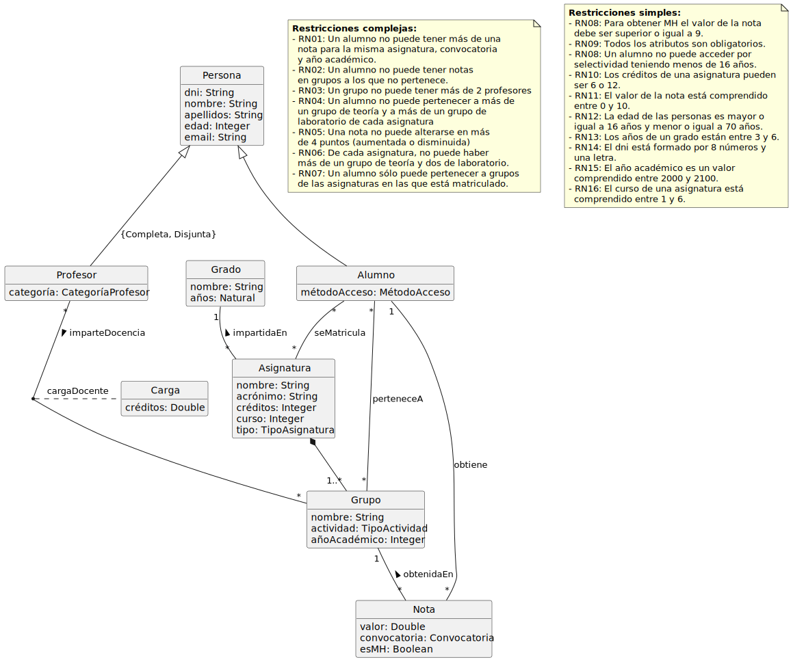

# GradesDB

Sistema académico universitario con asignaturas, grupos, matrículas y calificaciones. Incluye:
- Esquema en `sql/` (people, students, professors, degrees, subjects, groups, enrollments, teaching_loads, grades) con checks RN01–RN21 y triggers complejos para matrícula, límite de grupos, duplicidad de notas, etc.
- Funciones auxiliares de validación (límite de grupos, matriculación, conteo de grupos).
- Procedimiento `p_populate_grados` para cargar datos de prueba.
- Tests SQL en `tests/tests.sql` con harness `test_results`, `p_log_test` y orquestador `p_run_grados_tests`.

